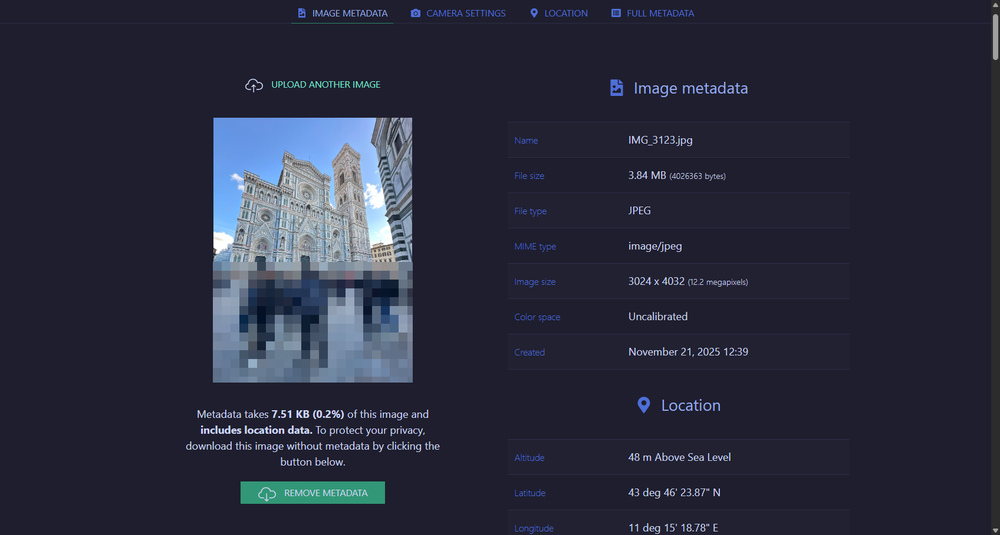
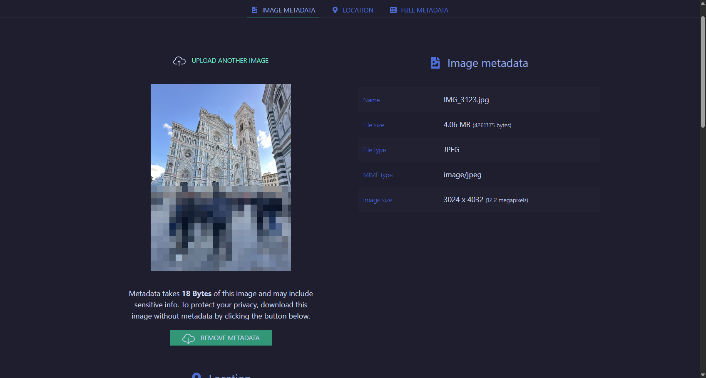

<div align="center">

```
███╗   ███╗███████╗████████╗ █████╗ ███████╗ ██████╗██████╗ ██╗   ██╗██████╗ 
████╗ ████║██╔════╝╚══██╔══╝██╔══██╗██╔════╝██╔════╝██╔══██╗██║   ██║██╔══██╗
██╔████╔██║█████╗     ██║   ███████║███████╗██║     ██████╔╝██║   ██║██████╔╝
██║╚██╔╝██║██╔══╝     ██║   ██╔══██║╚════██║██║     ██╔══██╗██║   ██║██╔══██╗
██║ ╚═╝ ██║███████╗   ██║   ██║  ██║███████║╚██████╗██║  ██║╚██████╔╝██████╔╝
╚═╝     ╚═╝╚══════╝   ╚═╝   ╚═╝  ╚═╝╚══════╝ ╚═════╝╚═╝  ╚═╝ ╚═════╝ ╚═════╝ 
                            CLEANER V.1.0
```

# 🧹 MetaScrub - Image Metadata Cleaner

### *Herramienta profesional CLI para eliminar metadatos EXIF, GPS y timestamps de imágenes de forma masiva*

[](https://www.python.org/)
[](https://github.com/qpbo/Metadata-Cleaner)
[](LICENSE)
[](https://github.com/qpbo/Metadata-Cleaner)

---


</div>

---

## 📖 Tabla de Contenidos

- [Descripción](#-descripción)
- [Características Principales](#-características-principales)
- [Capturas de Pantalla](#-capturas-de-pantalla)
  - [Antes y Después - Demostración Real](#-antes-y-después---demostración-real)
- [Instalación](#-instalación)
- [Uso](#-uso)
- [Cómo Funciona](#-cómo-funciona-técnicamente)
- [Formatos Soportados](#-formatos-soportados)
- [Estructura del Proyecto](#-estructura-del-proyecto)
- [Dependencias](#-dependencias)
- [Casos de Uso](#-casos-de-uso)
- [Roadmap](#-roadmap)
- [Contribuciones](#-contribuciones)
- [Créditos](#-créditos)
- [Licencia](#-licencia)

---

## 📝 Descripción

**MetaScrub** es una herramienta CLI (Command Line Interface) avanzada desarrollada en **Python 3.8+**, diseñada para profesionales de ciberseguridad, forense digital, fotógrafos y cualquier persona que necesite proteger su privacidad al compartir imágenes.

Con una arquitectura orientada a objetos y una interfaz colorida e intuitiva, MetaScrub elimina completamente los metadatos sensibles de tus imágenes sin comprometer la calidad visual, creando copias limpias mientras mantiene intactos los archivos originales.

> **💡 Ideal para:** Protección de privacidad, análisis forense, compliance GDPR, publicación segura de imágenes en redes sociales, y limpieza masiva de bibliotecas fotográficas.

---

## ✨ Características Principales

<table>
<tr>
<td width="50%">

### 🔒 **Seguridad Garantizada**
- NUNCA sobrescribe archivos originales
- Crea copias limpias en directorio separado
- Preserva la estructura de carpetas original
- Validación completa de rutas antes de procesar
- Manejo robusto de archivos corruptos

</td>
<td width="50%">

### 🧹 **Limpieza Completa**
- Elimina datos EXIF (ISO, apertura, velocidad, etc.)
- Borra coordenadas GPS (ubicación exacta)
- Remueve timestamps (fecha/hora de creación)
- Elimina información de cámara y lente
- Borra datos de software utilizado

</td>
</tr>
<tr>
<td width="50%">

### ⚡ **Procesamiento Masivo**
- Escaneo recursivo de directorios
- Procesamiento batch de cientos de imágenes
- Barra de progreso visual con `tqdm`
- Estadísticas en tiempo real
- Reporte final detallado

</td>
<td width="50%">

### 🎨 **Experiencia de Usuario**
- Interfaz CLI colorida con `colorama`
- Logs diferenciados por nivel (error/éxito/info)
- Modo verbose para debugging
- Feedback inmediato de operaciones
- Diseño multiplataforma (Windows/Linux/macOS)

</td>
</tr>
</table>

### 🎯 **Características Adicionales**

| Característica | Descripción |
|:--------------|:------------|
| **Zero Data Loss** | Calidad de imagen preservada al 95% (JPEG) y 100% (PNG) |
| **Type Hints** | Código completamente tipado para mayor mantenibilidad |
| **Clean Code** | Arquitectura OOP con clase `MetadataCleaner` |
| **Error Tracking** | Sistema de logging de errores con reporte final |
| **Docstrings** | Documentación inline en todos los métodos |
| **Multi-Format** | Soporte JPG, JPEG, PNG y WEBP |

---

## 📸 Capturas de Pantalla

<div align="center">

### 🖥️ Escaneo y Procesamiento

```
🔍 Scanning for images...
Found 150 image(s) to process

🧹 Cleaning metadata: 100%|████████████████| 150/150 [00:15<00:00]

============================================================
📊 PROCESSING REPORT
============================================================
✅ Successfully processed: 148
❌ Errors encountered: 2

⚠️  Error Details:
  • corrupted_image.jpg: cannot identify image file
  • invalid.png: Truncated file

📁 Clean images saved to: C:\Photos_Clean
============================================================
```

### 🔍 Modo Verbose

```
Input directory: C:\Users\Photos\Vacation
Output directory: C:\Users\Photos\Vacation_Clean

Processing: IMG_3421.jpg
Processing: IMG_3422.jpg
Processing: screenshot_001.png
...
```

### 📊 Antes y Después - Demostración Real

<table>
<tr>
<td width="50%" align="center">

#### ⚠️ ANTES de usar MetaScrub



**Metadata expuesta:**
- 📍 Coordenadas GPS (ubicación exacta)
- 📷 Modelo de cámara y lente
- ⏰ Fecha y hora exacta de captura
- 🔧 Configuración técnica (ISO, apertura, etc.)
- 💻 Software de edición utilizado

</td>
<td width="50%" align="center">

#### ✅ DESPUÉS de usar MetaScrub



**Metadata completamente eliminada:**
- ✅ Sin GPS - Privacidad protegida
- ✅ Sin información de cámara
- ✅ Sin timestamps
- ✅ Sin datos técnicos
- ✅ **100% Anónima y segura**

</td>
</tr>
</table>

> **🎯 Resultado:** La imagen visual se mantiene idéntica, pero toda la información sensible ha sido eliminada permanentemente.

</div>

---

## 🚀 Instalación

### Prerrequisitos

Asegúrate de tener instalado **Python 3.8** o superior en tu sistema:

```bash
python --version
```

### Método 1: Instalación Rápida (Recomendado)

```bash
# 1. Clona el repositorio
git clone https://github.com/qpbo/Metadata-Cleaner.git

# 2. Accede al directorio
cd Metadata-Cleaner

# 3. Instala las dependencias
pip install -r requirements.txt

# 4. Ejecuta la herramienta
python main.py --help
```

### Método 2: Instalación Manual

```bash
# Instala las dependencias manualmente
pip install Pillow tqdm colorama
```

### Verificación de Instalación

Para verificar que todo está correctamente instalado:

```bash
python main.py --help
```

Si ves el mensaje de ayuda con todas las opciones, ¡la instalación fue exitosa! 🎉

---

## 💻 Uso

### Inicio Rápido

1. **Ejecuta el script con directorios de entrada y salida:**
   ```bash
   python main.py --input "./mis_fotos" --output "./fotos_limpias"
   ```

2. **La herramienta procesará recursivamente** todas las imágenes encontradas

3. **Revisa el reporte final** con estadísticas de procesamiento

### Sintaxis Completa

```bash
python main.py --input <directorio_entrada> --output <directorio_salida> [--verbose]
```

**Argumentos:**
- `--input` / `-i` : Directorio con imágenes a limpiar (requerido)
- `--output` / `-o` : Directorio para guardar imágenes limpias (requerido)
- `--verbose` / `-v` : Activar salida detallada (opcional)

### Ejemplos de Uso

#### Ejemplo 1: Limpieza Básica
```bash
python main.py --input "./vacation_photos" --output "./vacation_clean"
```

#### Ejemplo 2: Con Rutas Absolutas
```bash
python main.py --input "C:/Users/Carlo/Pictures" --output "C:/Users/Carlo/Pictures_Clean"
```

#### Ejemplo 3: Modo Verbose (Debugging)
```bash
python main.py --input "./test_images" --output "./test_clean" --verbose
```

#### Ejemplo 4: Subcarpetas (Automático)
```bash
# Estructura de entrada:
# photos/
# ├── 2024/
# │   ├── enero/
# │   └── febrero/
# └── 2025/

python main.py --input "./photos" --output "./photos_clean"

# Resultado preserva la estructura:
# photos_clean/
# ├── 2024/
# │   ├── enero/    (imágenes limpias)
# │   └── febrero/  (imágenes limpias)
# └── 2025/         (imágenes limpias)
```

---

## 🔧 Cómo Funciona (Técnicamente)

### La Técnica "Strip Data on Save"

MetaScrub utiliza una técnica elegante y efectiva basada en la librería **Pillow (PIL)**:

```python
# 1. Abrir imagen (carga píxeles, NO EXIF)
with Image.open(input_image) as img:
    # 2. Extraer solo datos de píxeles
    data = list(img.getdata())
    
    # 3. Crear nueva imagen SIN metadatos
    clean_img = Image.new(img.mode, img.size)
    clean_img.putdata(data)
    
    # 4. Guardar SIN parámetro 'exif'
    # Resultado: Imagen limpia sin metadata
    clean_img.save(output_image, quality=95, optimize=True)
```

### ¿Por Qué Funciona?

**Clave del proceso:**
- `Image.save()` de Pillow **NO** copia automáticamente los metadatos EXIF
- Los metadatos solo se preservan si se pasa explícitamente el parámetro `exif=`
- Al omitir este parámetro, creamos una copia completamente limpia
- Esta técnica funciona en todos los formatos soportados (JPEG, PNG, WEBP)

### Flujo del Proceso

```
1. Escaneo Recursivo
   └─> Encuentra todas las imágenes (.jpg, .jpeg, .png, .webp)
   
2. Validación
   └─> Verifica que input existe y crea output
   
3. Procesamiento por Lotes
   ├─> Para cada imagen:
   │   ├─> Abre y lee píxeles
   │   ├─> Crea nueva imagen sin metadata
   │   ├─> Guarda en estructura paralela
   │   └─> Maneja errores individualmente
   └─> Continúa sin interrumpirse si hay errores
   
4. Reporte Final
   └─> Estadísticas: procesadas, errores, ubicación
```

---

## 🖼️ Formatos Soportados

| Formato | Extensión | Calidad | Metadata Eliminada |
|:--------|:----------|:--------|:-------------------|
| **JPEG** | `.jpg`, `.jpeg`, `.JPG`, `.JPEG` | 95% (configurable) | ✅ EXIF, GPS, timestamps |
| **PNG** | `.png`, `.PNG` | Sin pérdida (100%) | ✅ Metadata chunks |
| **WEBP** | `.webp`, `.WEBP` | 95% (configurable) | ✅ EXIF, XMP |

### Metadata Específica Eliminada

**EXIF Data:**
- Marca y modelo de cámara
- Configuración de disparo (ISO, apertura, velocidad)
- Información de lente y distancia focal
- Flash utilizado
- Balance de blancos
- Software de edición

**GPS Data:**
- Latitud y longitud exactas
- Altitud
- Timestamp GPS
- Dirección de la imagen

**Timestamps:**
- Fecha y hora de creación original
- Fecha y hora de modificación
- Fecha y hora de digitalización

**Otros:**
- Copyright y autoría
- Descripción y comentarios
- Miniaturas embebidas
- Perfiles de color

---

## 📂 Estructura del Proyecto

```
Metadata-Cleaner/
│
├── 📄 main.py                 # Script principal (295 líneas)
│   ├── Clase: MetadataCleaner
│   │   ├── __init__()         # Inicialización y validación
│   │   ├── _validate_paths()  # Validar input/output
│   │   ├── _find_images()     # Búsqueda recursiva
│   │   ├── _get_output_path() # Calcular ruta de salida
│   │   ├── _clean_image_metadata() # Limpieza EXIF
│   │   ├── process()          # Orquestador principal
│   │   └── _print_report()    # Reporte final
│   └── main()                 # Entry point CLI
│
├── 📄 requirements.txt        # Dependencias del proyecto
│   ├── Pillow>=10.0.0
│   ├── tqdm>=4.65.0
│   └── colorama>=0.4.6
│
├── 📄 README.md               # Documentación completa
│
└── 📄 LICENSE                 # Licencia MIT (opcional)
```

### Arquitectura del Código

```
main.py
│
├── [Imports y Configuración]
│   ├── PIL (Procesamiento de imágenes)
│   ├── tqdm (Barras de progreso)
│   ├── colorama (Colores CLI)
│   └── pathlib (Manejo de rutas)
│
├── [Clase MetadataCleaner]          # Backend de operaciones
│   ├── SUPPORTED_FORMATS            # Constante de formatos
│   ├── __init__()                   # Constructor
│   ├── _validate_paths()            # Validación de directorios
│   ├── _find_images()               # Búsqueda recursiva
│   ├── _get_output_path()           # Cálculo de rutas
│   ├── _clean_image_metadata()      # Limpieza de metadata
│   ├── process()                    # Proceso principal
│   └── _print_report()              # Reporte de estadísticas
│
└── [main()]                         # Entry point
    ├── ArgumentParser               # CLI con argparse
    ├── Instancia de MetadataCleaner
    └── Exception handling global
```

---

## 📦 Dependencias

El proyecto utiliza las siguientes librerías de Python:

| Librería | Versión | Propósito |
|:---------|:--------|:----------|
| **Pillow** | `>=10.0.0` | Procesamiento de imágenes y eliminación de EXIF |
| **tqdm** | `>=4.65.0` | Barras de progreso y feedback visual |
| **colorama** | `>=0.4.6` | Colores y estilización de la interfaz CLI |

### requirements.txt

```txt
Pillow>=10.0.0
tqdm>=4.65.0
colorama>=0.4.6
```

### Instalación de Dependencias

```bash
pip install -r requirements.txt
```

O instalar individualmente:

```bash
pip install Pillow tqdm colorama
```

---

## 🛡️ Casos de Uso

### 1️⃣ Protección de Privacidad Personal

**Escenario:** Quieres compartir fotos de vacaciones en redes sociales sin revelar tu ubicación exacta.

```bash
python main.py --input "./vacation_2024" --output "./vacation_2024_safe"
```

**Resultado:** Imágenes sin GPS, sin metadatos de cámara, listas para compartir de forma anónima.

---

### 2️⃣ Compliance GDPR / Privacidad de Datos

**Escenario:** Tu empresa necesita publicar imágenes en su sitio web sin incluir metadata personal.

```bash
python main.py --input "./corporate_photos" --output "./web_ready_photos" --verbose
```

**Resultado:** Imágenes sin timestamps, sin información de autor, cumpliendo con regulaciones de privacidad.

---

### 3️⃣ Análisis Forense Digital

**Escenario:** Necesitas crear copias de evidencia fotográfica sin metadata para presentación pública.

```bash
python main.py --input "./evidence_raw" --output "./evidence_clean"
```

**Resultado:** Copias seguras sin metadata sensible, manteniendo los originales intactos.

---

### 4️⃣ Publicación Anónima

**Escenario:** Periodista o activista que necesita publicar fotos sin comprometer su identidad o ubicación.

```bash
python main.py --input "./field_photos" --output "./anonymous_photos" --verbose
```

**Resultado:** Imágenes completamente anónimas, sin trazabilidad geográfica o temporal.

---

### 5️⃣ Limpieza de Bibliotecas Fotográficas

**Escenario:** Tienes miles de fotos antiguas que quieres limpiar antes de archivarlas en la nube.

```bash
python main.py --input "C:/Photos/2010-2020" --output "C:/Photos_Clean/2010-2020"
```

**Resultado:** Biblioteca completa procesada con estructura de carpetas preservada.

---

## 🗺️ Roadmap

### Versión 1.0.0 (Actual) ✅
- [x] Limpieza completa de metadatos EXIF
- [x] Soporte JPG, JPEG, PNG, WEBP
- [x] Procesamiento recursivo de directorios
- [x] Barra de progreso con tqdm
- [x] Interfaz CLI colorida
- [x] Reporte final de estadísticas
- [x] Manejo robusto de errores
- [x] Type hints completos

### Versión 1.1.0 (Próxima) 🚧
- [ ] Modo de análisis (preview de metadata sin eliminar)
- [ ] Exportación de metadata a JSON/CSV antes de limpiar
- [ ] Opción de backup automático
- [ ] Soporte para más formatos (TIFF, BMP, GIF)
- [ ] Preservar metadata selectiva (ej: solo eliminar GPS)
- [ ] Modo dry-run (simular sin ejecutar)

### Versión 2.0.0 (Futuro) 💡
- [ ] Interfaz gráfica (GUI) opcional con tkinter
- [ ] Procesamiento paralelo multi-thread
- [ ] Compresión inteligente de imágenes
- [ ] Integración con cloud storage (Google Drive, Dropbox)
- [ ] Creación de reportes en PDF
- [ ] API REST para integración con otros servicios
- [ ] Docker container para deployment

¿Tienes una sugerencia? ¡[Abre un issue](https://github.com/qpbo/Metadata-Cleaner/issues)!

---

## 🤝 Contribuciones

Las contribuciones son **bienvenidas** y se agradecen enormemente. Si deseas contribuir:

### Cómo Contribuir

1. **Fork** el repositorio
2. Crea una **rama** para tu feature (`git checkout -b feature/AmazingFeature`)
3. Haz **commit** de tus cambios (`git commit -m 'Add some AmazingFeature'`)
4. **Push** a la rama (`git push origin feature/AmazingFeature`)
5. Abre un **Pull Request**

### Código de Conducta

- Sé respetuoso con otros contribuidores
- Reporta bugs de manera constructiva
- Documenta tus cambios claramente
- Sigue el estilo de código existente (PEP 8)
- Incluye type hints en todo código nuevo

### Reportar Bugs

Si encuentras un bug, por favor abre un [issue](https://github.com/qpbo/Metadata-Cleaner/issues) con:
- Descripción del problema
- Pasos para reproducirlo
- Comportamiento esperado vs. actual
- Screenshots (si aplica)
- Información del sistema (OS, versión de Python)
- Tipo y tamaño de imágenes afectadas

---

## 👨‍💻 Créditos

<div align="center">

### Desarrollado con ❤️ por **Carliyo**

[](https://github.com/qpbo)
[](https://discord.com)

**Versión:** 1.0.0  
**Año:** 2026  
**Mantenido:** Sí ✅

</div>

### Agradecimientos

- Comunidad de Python por Pillow, tqdm y colorama
- Inspiración de herramientas forenses profesionales
- Todos los contribuidores futuros

---

## 📄 Licencia

Este proyecto está licenciado bajo la **Licencia MIT** - ver el archivo [LICENSE](LICENSE) para más detalles.

```
MIT License

Copyright (c) 2026 Carliyo

Permission is hereby granted, free of charge, to any person obtaining a copy
of this software and associated documentation files (the "Software"), to deal
in the Software without restriction, including without limitation the rights
to use, copy, modify, merge, publish, distribute, sublicense, and/or sell
copies of the Software, and to permit persons to whom the Software is
furnished to do so, subject to the following conditions:

The above copyright notice and this permission notice shall be included in all
copies or substantial portions of the Software.

THE SOFTWARE IS PROVIDED "AS IS", WITHOUT WARRANTY OF ANY KIND, EXPRESS OR
IMPLIED, INCLUDING BUT NOT LIMITED TO THE WARRANTIES OF MERCHANTABILITY,
FITNESS FOR A PARTICULAR PURPOSE AND NONINFRINGEMENT.
```

---

<div align="center">

### 🌟 Si este proyecto te fue útil, considera darle una estrella! ⭐

[](https://github.com/qpbo/Metadata-Cleaner)

---

**Made with Python 🐍 | Powered by Pillow 🖼️ | Privacy First 🔒**

*Última actualización: Enero 2026*

</div>
